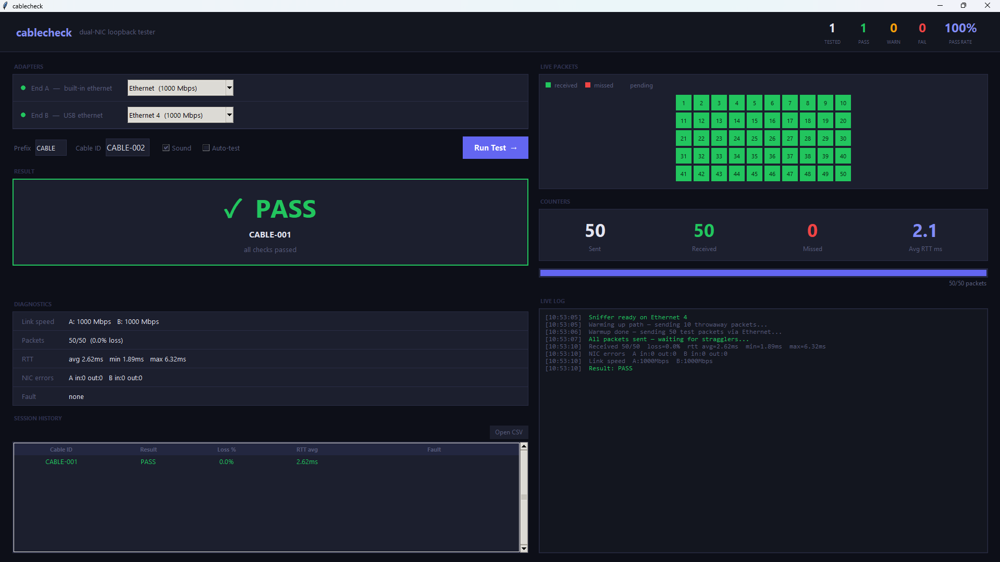

# cablecheck

> Bulk CAT cable tester for Windows — no hardware required.

Plug both ends of a patch cable into the same laptop and cablecheck tells you if it passes in under 10 seconds. Built for testing large cable runs fast.

---

## ⬇ Download

**[Download the latest installer → cablecheck_setup.exe](https://github.com/Bryson-he/cablecheck/releases/latest)**

The installer handles everything — no Python, no manual setup.

---

## How it works

Plug both ends of a CAT cable into the same Windows laptop — one end into the built-in ethernet port, the other into a USB-to-ethernet adapter. cablecheck sends real traffic across it, measures packet loss and latency, and gives you a clear PASS, WARN, or FAIL result with a logged CSV entry.

No dedicated cable tester hardware needed.

---

## What it detects

| Fault | |
|---|---|
| Dead cable / open circuit | ✅ |
| Packet loss from bad crimp | ✅ |
| Link below Gigabit — pairs 4, 5, 7, 8 | ✅ |
| NIC error counters — split pair | ✅ |
| High latency — marginal cable | ✅ |
| Per-pin continuity | ❌ needs a hardware tester |

---

## Features

**Live packet grid** — 50 squares light up green as packets arrive and red if missed. You can see exactly what the cable is doing during the test.

**Auto-test mode** — tick Auto-test and cablecheck watches for the cable to be unplugged, waits for the next one to connect and negotiate, then fires automatically. Hands-free for bulk runs.

**Session stats** — running tally of tested, passed, warned, failed, and pass rate across the top of the window for the whole session.

**CSV logging** — every result is automatically saved to a dated CSV file so you have a full record of every cable tested.

**Sound** — audible beep on result so you can swap cables without watching the screen.

---

## Requirements

- Windows 10 or 11
- Built-in ethernet port + USB-to-ethernet adapter
- Administrator rights — prompted automatically by the installer
- Npcap — installed automatically by the setup wizard

---

## Usage

1. Launch **cablecheck** from the desktop shortcut
2. Select your adapters — End A (built-in) and End B (USB)
3. Plug both ends of the cable in
4. Hit **Run Test** or press **Enter**

For bulk testing, tick **Auto-test** — just keep swapping cables.

---

## Result codes

| Result | Meaning |
|---|---|
| ✅ `PASS` | Cable is good |
| ⚠️ `WARN` | Cable works but has issues — re-terminate recommended |
| ❌ `FAIL` | Cable failed — do not use |

---

## License

MIT — free to use, modify, and distribute.
